# Predictive Precision: A Comprehensive Analysis of Urban Water Quality

---

## 1. Project Overview

This project is dedicated to developing a robust, data-driven framework for the early detection of urban water quality deterioration. The initiative leverages advanced machine learning techniques to provide a scalable and efficient alternative to traditional, labor-intensive monitoring methods. The ultimate goal is to create a system capable of real-time anomaly detection, thereby safeguarding public health and optimizing the operational efficiency of water distribution networks.

---

## 2. Phase 1: Supervised Learning on NYC Dataset

### 2.1. Objective

The initial phase focused on a supervised machine learning approach using the "NYC Drinking Water Quality Distribution Monitoring Data."

### 2.2. Methodology

- **Target Variable Engineering:** A binary target, `Deterioration`, was synthesized from microbiological indicators (`Coliform` and `E.coli`). A reading other than `<1` in either indicator was classified as a deterioration event.
- **Data Preprocessing:** A rigorous pipeline was established to handle missing values (mean imputation), erroneous data (e.g., negative chlorine values), and to engineer temporal features from timestamps.
- **Modeling:** An XGBoost classifier was selected due to its performance capabilities. The severe class imbalance in the dataset was addressed by employing the Synthetic Minority Over-sampling Technique (SMOTE).

### 2.3. Results

The final XGBoost model yielded strong performance, optimized for high recall to minimize false negatives in a public health context:

| Metric    | Score  |
| :-------- | :----- |
| Accuracy  | 0.8344 |
| F1-score  | 0.8578 |
| Precision | 0.7514 |
| Recall    | 0.9994 |

#### 2.3.1. Visualizations

*Figure 1: Distribution of Residual Free Chlorine and Turbidity.*

  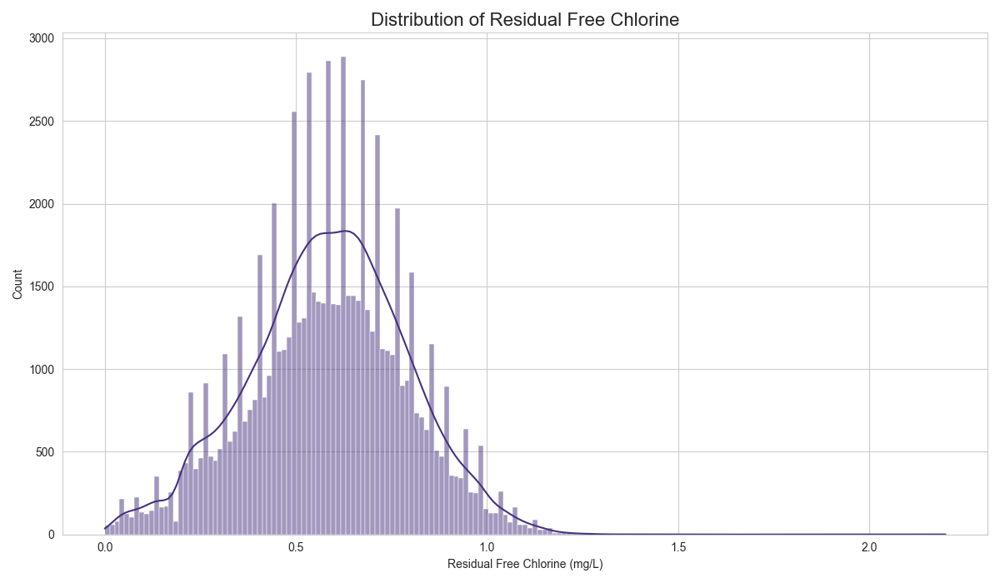
  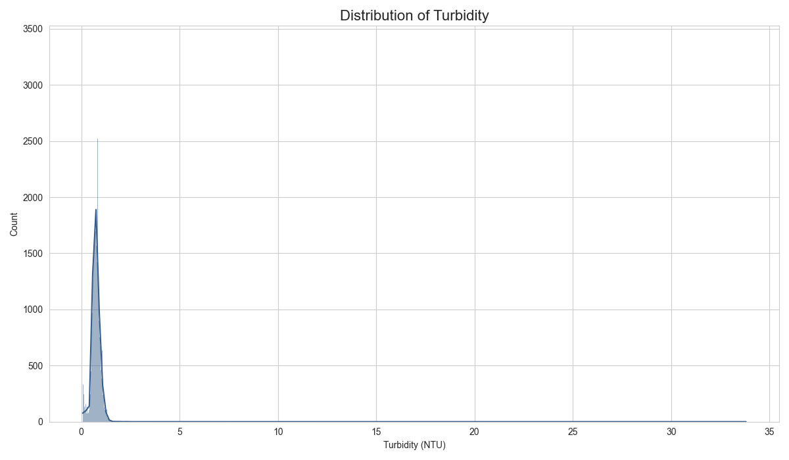

*These histograms illustrate the frequency distribution of Residual Free Chlorine and Turbidity, revealing their typical ranges and any skewness in the data.*

*Figure 2: Distribution of the target variable, highlighting the class imbalance.*

  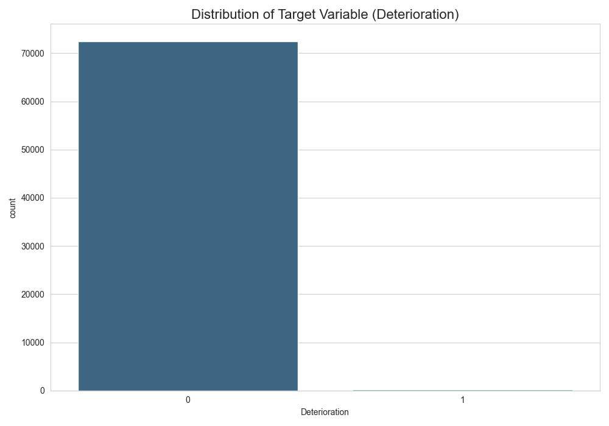

*Figure 3: Correlation matrix of the numerical features.*

  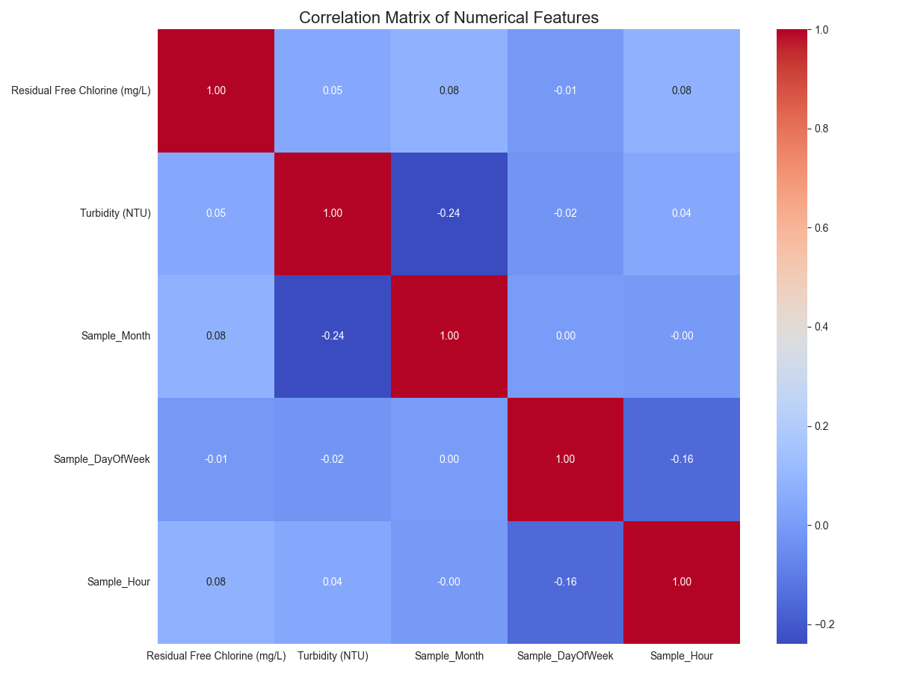

*Figure 4: Deterioration events over time, showing seasonal patterns.*

  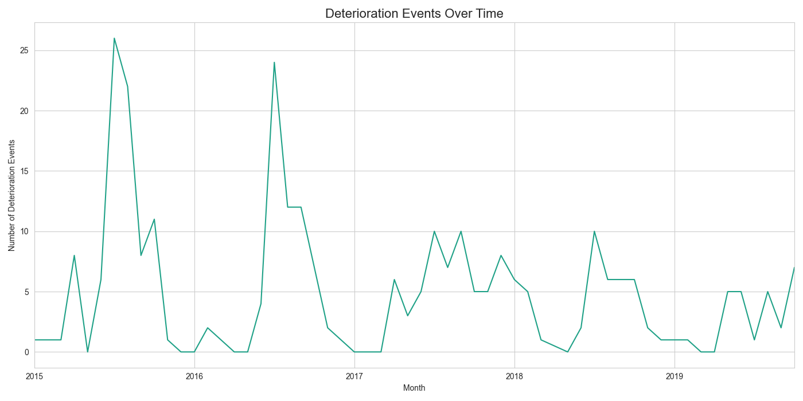

*Figure 5: Feature importance plot.*

  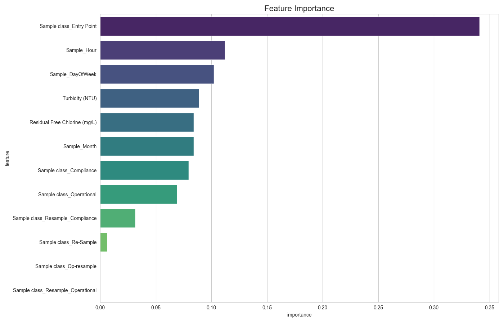

*Figure 6: ROC-AUC curve and confusion matrix.*

  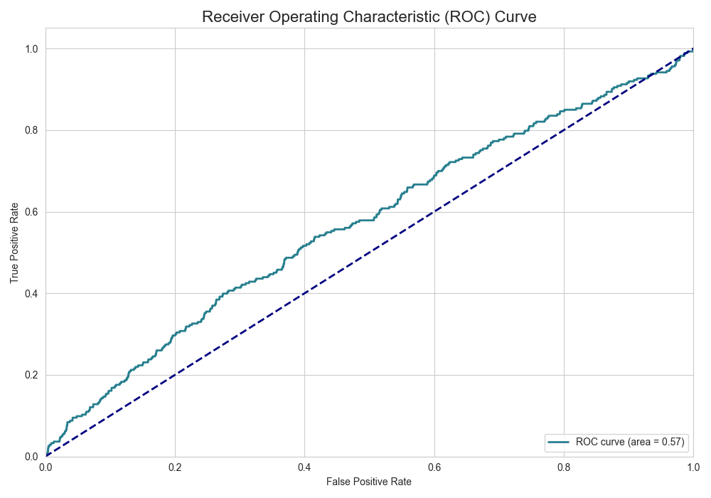
  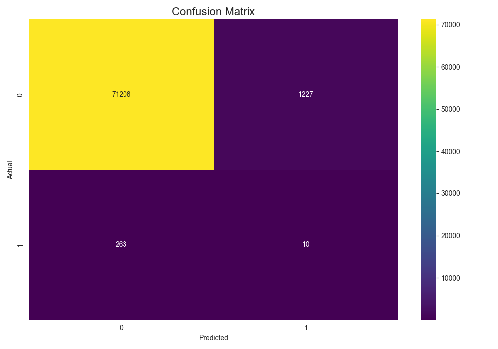

*Figure 7: Precision-recall curve.*

  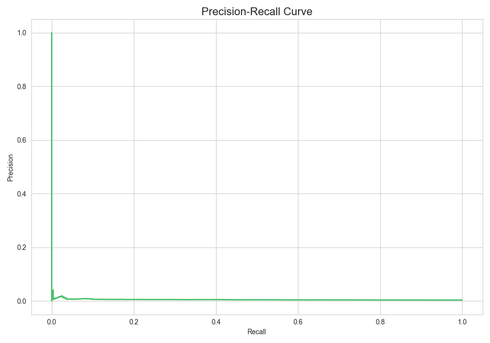

### 2.4. Deployment

The model was successfully deployed via a Flask web application, providing a user interface for real-time predictions.

---

## 3. Phase 2: Supervised Learning on Brisbane Dataset

### 3.1. Objective

This phase replicated the supervised learning workflow on a new dataset, "Brisbane Water Quality," to assess the methodology's transferability.

### 3.2. Methodology

- **Data Preprocessing:** The `[quality]` columns were deemed uninformative and removed. Missing values were imputed using the mean.
- **Target Variable Engineering:** A new `Deterioration` target was engineered based on a composite rule: `Turbidity` above the 90th percentile AND (`Dissolved Oxygen` below the 10th percentile OR `pH` outside the 6.5-8.5 range).
- **Modeling:** An XGBoost classifier with SMOTE was trained on this new dataset.

### 3.3. Results

The model achieved near-perfect metrics, indicating that the algorithm had successfully learned the explicit, rule-based definition of deterioration provided.

| Metric    | Score  |
| :-------- | :----- |
| Accuracy  | 0.9999 |
| F1-score  | 0.9999 |
| Precision | 0.9998 |
| Recall    | 1.0000 |

#### 3.3.1. Visualizations

*Figure 8: Distribution of key features for the Brisbane dataset.*

  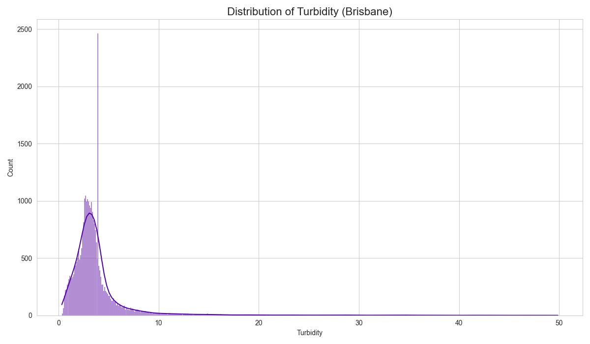
  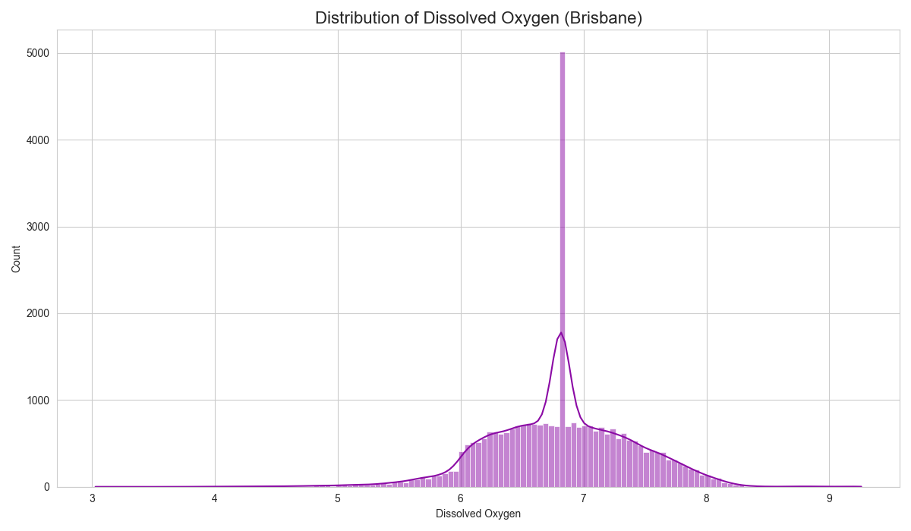
  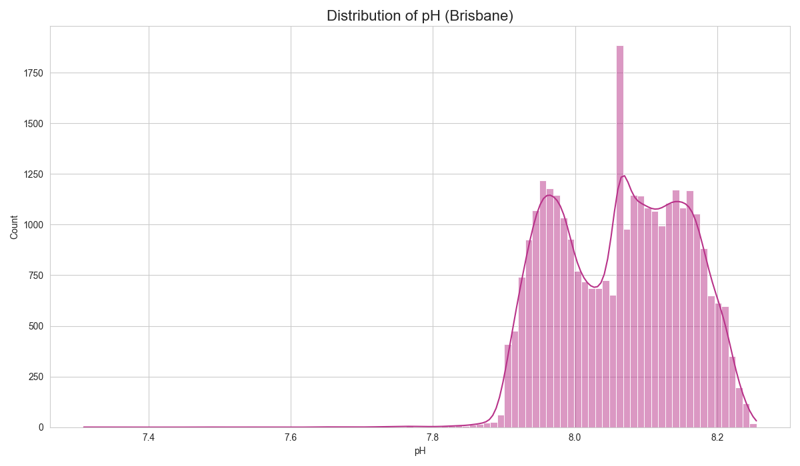

*Figure 9: Distribution of the engineered target variable for the Brisbane dataset.*

  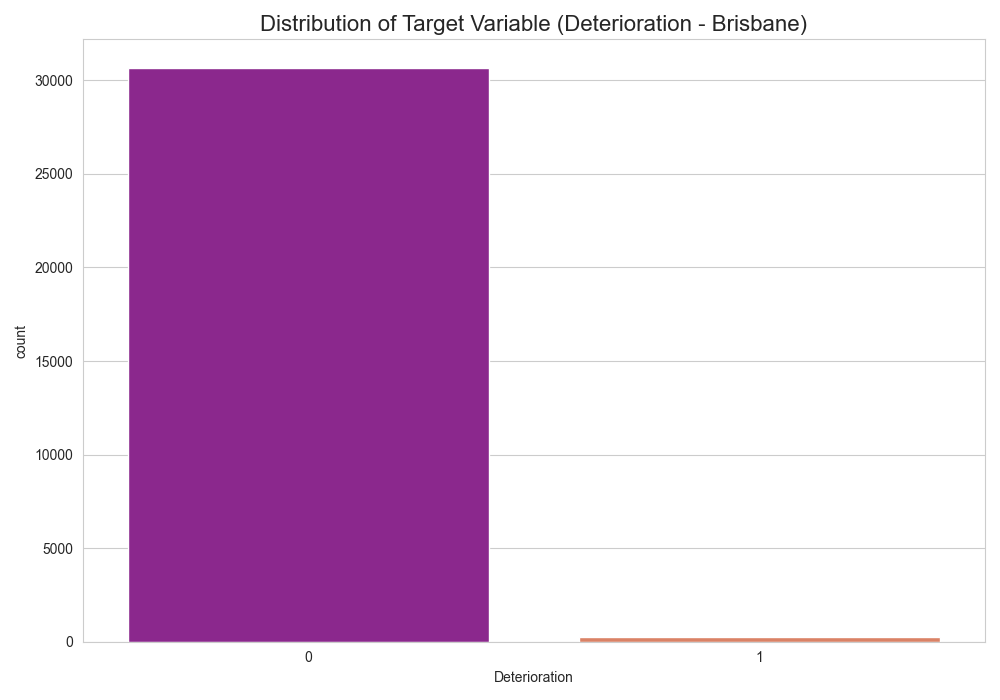

*Figure 10: Feature importance for the Brisbane supervised model.*

  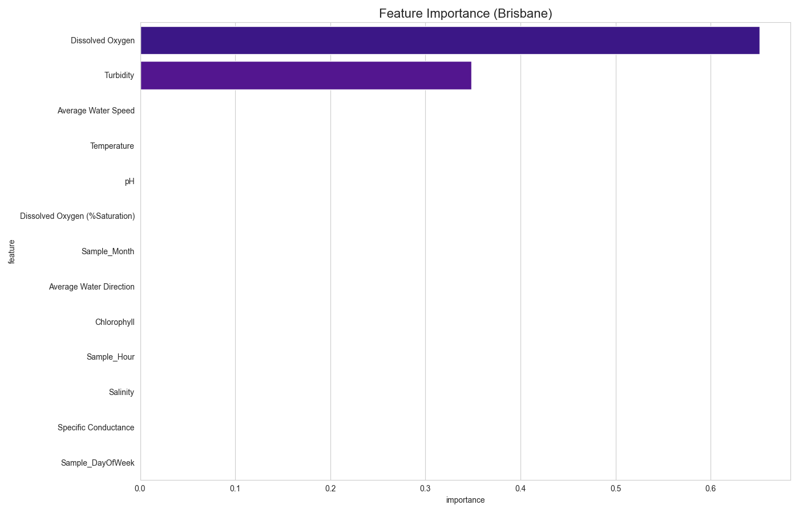

*Figure 11: ROC-AUC curve and confusion matrix for the Brisbane supervised model.*

  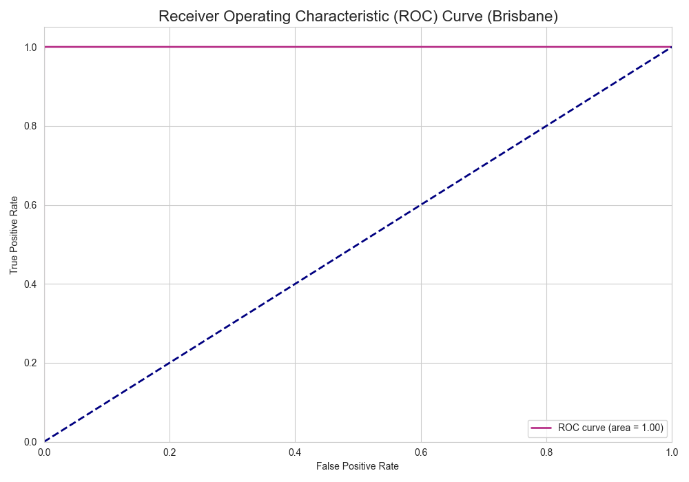
  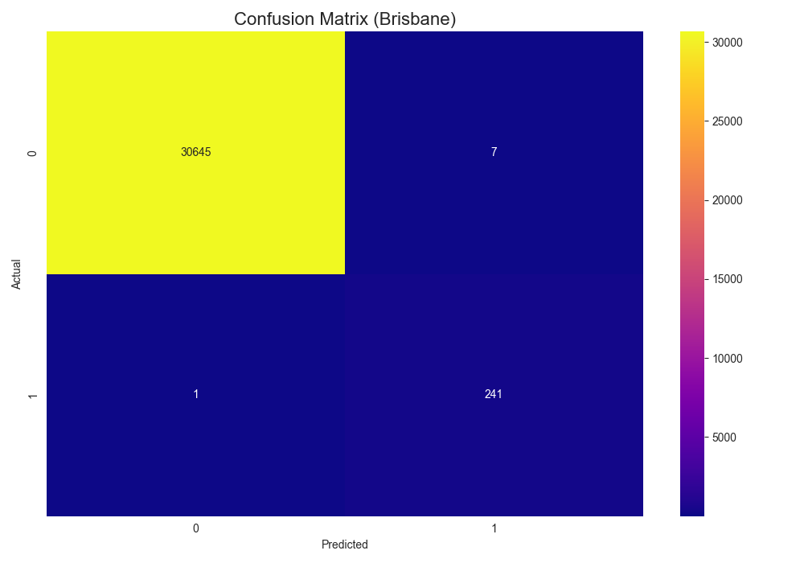

### 3.4. Critical Insight

The perfect scores, while impressive, revealed a dependency on the predefined rules. This prompted the strategic pivot to a more sophisticated, unsupervised approach to allow for the discovery of novel, undefined anomalies.

---

## 4. Phase 3: Unsupervised Anomaly Detection on Brisbane Dataset

### 4.1. Objective

To develop a generalized, self-learning model that can detect water quality anomalies without relying on predefined rules. This phase will explore three distinct unsupervised algorithms.

### 4.2. Experiment 1: Isolation Forest

- **Algorithm:** Isolation Forest
- **Principle:** This algorithm is based on the principle that anomalies are "few and different" and should therefore be easier to "isolate" from the bulk of the data points. It builds an ensemble of decision trees, and the number of splits required to isolate a sample is used as its anomaly score.
- **Implementation:** An Isolation Forest model was trained on the preprocessed Brisbane dataset (excluding the synthetic `Deterioration` label). The `contamination` parameter, which estimates the proportion of outliers, was set to `0.01`.
- **Results:** The model identified **309** data points as anomalies. A comparative analysis of the anomalous versus normal data reveals distinct characteristics of the anomalies, most notably a significantly higher mean Chlorophyll level (6.05 vs. 2.75 in the normal set). This indicates the model is successfully identifying meaningful deviations in the data.

### 4.3. Experiment 2: Local Outlier Factor (LOF)

- **Algorithm:** Local Outlier Factor (LOF)
- **Principle:** LOF is a density-based algorithm. It compares the local density of a point to the local densities of its neighbors. Points that have a substantially lower density than their neighbors are considered outliers.
- **Implementation:** A Local Outlier Factor (LOF) model was trained on the same preprocessed data. The `contamination` parameter was also set to `0.01`. LOF is a density-based method that identifies outliers by comparing the local density of a point to that of its neighbors.
- **Results:** The LOF model identified **243** anomalies. While also sensitive to high Chlorophyll levels (mean of 5.30 vs. 2.76), the LOF-identified anomalies also exhibited a significantly higher mean Temperature (25.3°C vs. 22.4°C in the normal set), suggesting a different but equally valid perspective on anomalous behavior.

### 4.4. Experiment 3: Autoencoder

- **Algorithm:** Autoencoder (Neural Network)
- **Principle:** An autoencoder is trained to reconstruct its input data. When trained on a dataset of "normal" instances, it learns the underlying patterns of normality. When a new, anomalous data point is fed into the network, it will struggle to reconstruct it, leading to a high "reconstruction error." This error is used as the anomaly score.
- **Implementation:** A neural network-based Autoencoder was constructed and trained to learn a compressed representation of the normal data. The model was trained for 50 epochs. Anomalies were identified by calculating the Mean Squared Error (MSE) of reconstruction for each data point and flagging the top 1% with the highest error.
- **Results:** The Autoencoder identified **309** anomalies. The primary indicator, reconstruction error, was significantly higher for the anomaly class (mean of 6.17 vs. 0.67). These anomalies also corresponded with higher mean Chlorophyll levels (4.51 vs. 2.76), confirming that this deep learning approach is also capable of identifying significant deviations in the water quality data.

### 4.6. Experiment 4: Ensemble Model

To create a more robust and reliable anomaly detection system, an ensemble model was created by combining the predictions of the three individual unsupervised models.

- **Methodology:** A majority vote system was implemented. A data point is classified as an anomaly if at least two out of the three models (Isolation Forest, LOF, and Autoencoder) flag it as an anomaly.
- **Results:** The ensemble model identified **190** high-confidence anomalies. These anomalies exhibited an even stronger deviation in key features, such as a mean Chlorophyll level of **6.31**, confirming that the ensemble approach successfully isolates the most significant and agreed-upon instances of anomalous water quality.

To gain a deeper understanding of the anomaly detection capabilities of each model, a comparative analysis was performed, and the results were visualized.

- **Overlap Analysis:**
    - Anomalies detected by **Isolation Forest only**: 156
    - Anomalies detected by **LOF only**: 170
    - Anomalies detected by **Autoencoder only**: 138
    - Overlap between **Isolation Forest and LOF**: 39
    - Overlap between **Isolation Forest and Autoencoder**: 137
    - Overlap between **LOF and Autoencoder**: 57
    - Anomalies detected by **all three models**: 23

This analysis highlights that while there is a core set of anomalies agreed upon by all models, each algorithm also identifies unique deviations, underscoring the value of a multi-model approach.

- **In Depth Analysis:**
   * High Agreement: There are 23 data points that all three models agree are anomalous. These are the highest-confidence anomalies, and their characteristics (e.g., very high Chlorophyll) make them stand out.
   * Significant Overlap: There are also significant overlaps between pairs of models (e.g., 137 anomalies flagged by both Isolation Forest and the Autoencoder).
   * Unique Detections: Each model also identifies a substantial number of unique anomalies (e.g., 156 by Isolation Forest only). Thishighlights the value of using multiple algorithms, as each one is sensitive to different types of deviations from the norm.

- **Visualizations:**

*Figure 12: Venn diagram showing the overlap of anomalies and unique detections across the three unsupervised models.*

  

*Figure 13: A scatter plot illustrating the distribution of anomalies based on key features (e.g., Chlorophyll and Turbidity), color-coded by the detecting model(s).*

  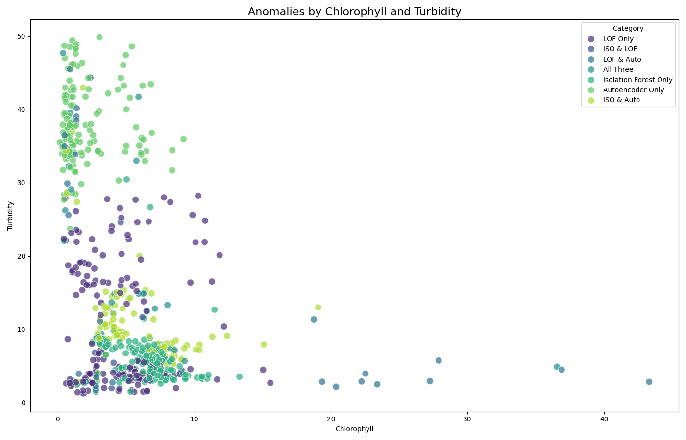

This plot visually confirms that high-confidence anomalies often correspond to extreme values in critical water quality parameters.
---

## 5. Conclusion and Future Work

This project successfully demonstrated the application of both supervised and unsupervised machine learning techniques for urban water quality deterioration detection. The pivot to unsupervised anomaly detection for the Brisbane dataset proved crucial in moving beyond rule-based limitations, allowing for the discovery of novel and undefined anomalies. The comparative analysis of Isolation Forest, Local Outlier Factor, and Autoencoder revealed that each algorithm offers a unique perspective, advocating for an ensemble approach in real-world deployments.

Future work could involve:
- Integrating the selected anomaly detection model(s) into the Flask web application.
- Developing an ensemble scoring mechanism to combine the outputs of multiple anomaly detectors.
- Exploring time-series specific anomaly detection techniques to leverage the temporal nature of the data.
- Incorporating external data sources (e.g., weather, industrial discharge records) to enrich the feature set and improve predictive power.
- Collaborating with domain experts to refine the definition of 'deterioration' and validate detected anomalies.

---

